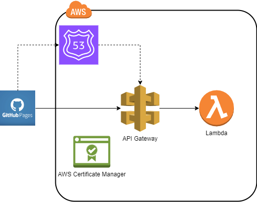

# 🧪 SMILES2Mol

**Convert SMILES notation to molecular structures with serverless AWS backend and GitHub Pages frontend.**

[](https://hyperverseglobalconsulting.github.io/smiles2mol/webpage.html)
[](https://projects.vizeet.me/smiles2mol)
[](LICENSE)

 <!-- Add your architecture diagram -->

---

## 📖 Overview

A cloud-native tool to convert SMILES strings into 2D molecular structures:
- **Frontend**: Static web interface hosted on GitHub Pages
- **Backend**: Serverless AWS infrastructure for SMILES processing

---

## 🌐 Architecture

### Frontend
- **Hosting**: GitHub Pages (zero-cost static hosting)
- **Tech Stack**:
  - HTML/JavaScript for UI
  - Simple form interface with image display
  - Fetches data from AWS API Gateway
- **URL**: [https://hyperverseglobalconsulting.github.io/smiles2mol/webpage.html](https://hyperverseglobalconsulting.github.io/smiles2mol/webpage.html)

### Backend
- **API Gateway**: 
  - Custom domain: `projects.vizeet.me/smiles2mol`
  - HTTPS enabled via AWS ACM-managed SSL certificate
- **Lambda Function**:
  - Python-based SMILES processing
  - Uses RDKit for molecular structure generation

## 🌐 Architecture

### 1. Static Web Hosting

### 2. Backend Processing Pipeline

### 3. Domain & Certificate Management
1. **ACM Certificate**: Request SSL certificate for `projects.vizeet.me` (us-east-2 region)
2. **API Gateway**: Configure custom domain with certificate
3. **Route53**: Create CNAME record pointing to API Gateway DNS


## 🛠️ Implementation

### Frontend (Static Hosting)
```bash
# Clone repository
git clone https://github.com/hyperverseglobalconsulting/smiles2mol.git
```
# Enable GitHub Pages:
1. Go to Repository Settings → Pages
2. Select branch (main/master) and root folder
3. Enforce HTTPS
